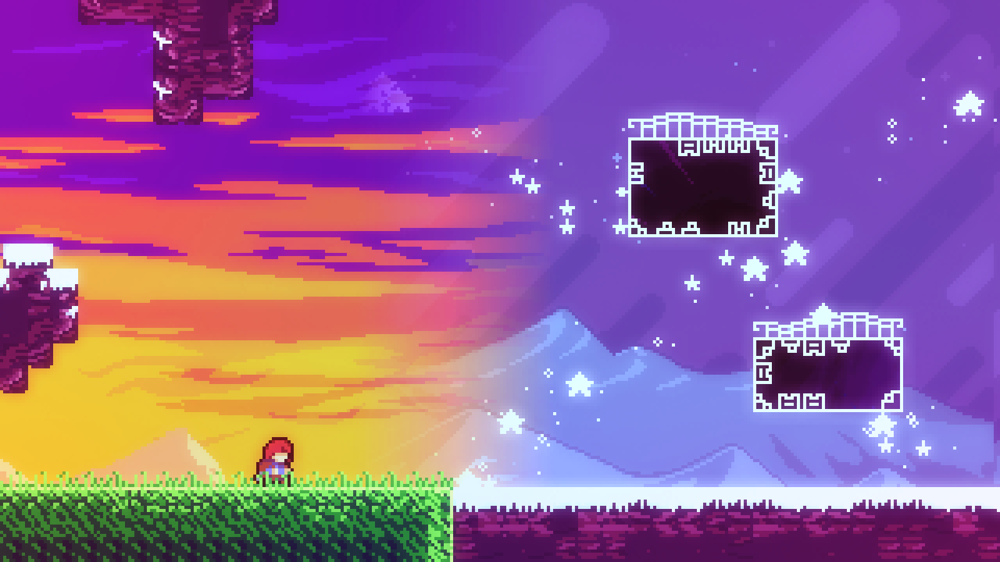
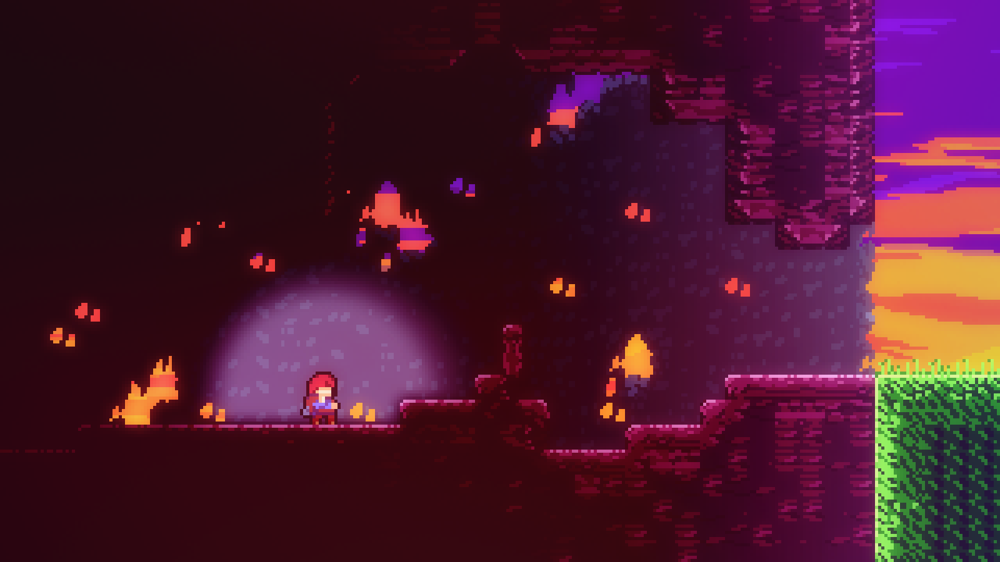
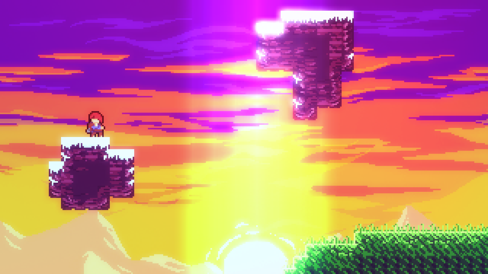

# Style Mask Helper

Style Mask Helper adds a variety of "mask" entities that change certain aspects of the level's visuals for just a specified area, and optionally smoothly fade them!

This mod currently contains:

- Styleground Masks
- Lighting Masks
- Color Grade Masks
- Bloom Masks

## Usage

### Styleground Masks

To mask a styleground, give it a tag with the `mask_` prefix, and use the same tag (without the prefix) inside the styleground mask options. For example, if you give a styleground the `mask_stars` tag, you'll want to put `stars` as the "Tag" option for your styleground mask.

Stylegrounds with a `mask_` tag will not be visible outside of a styleground mask!

### Custom Fade

**Note: This does not currently work in many cases! Use at your own risk in case fixes change stuff.**

All masks can be given an image for their shape instead of just a rectangle using the "Custom" fade mode by placing an image inside the `Gameplay/fademasks` graphics folder, and setting the "Custom Fade" option to the image's path (relative to the `fademasks` folder).

The image should only consist of transparency and white, where the white is where your mask will render. The image will be stretched to fit your mask, so make sure you have the sizes right!

The mod comes with a few [default fade masks](Graphics/Atlases/Gameplay/fademasks/) you can use, so check those for examples.

## Known Issues

- Custom Fade option has a variety of issues:
  - Styleground masks dont support transparent stylegrounds (big issue for foregrounds)
  - Color grade masks look ugly with partial transparency
  - Bloom masks just dont work with it
  - Lighting masks dont work with it either (and also break light sources in their area)

## Screenshots

**Styleground Mask**

**Lighting Mask**

**Color Grade Mask**

**Bloom Mask**
